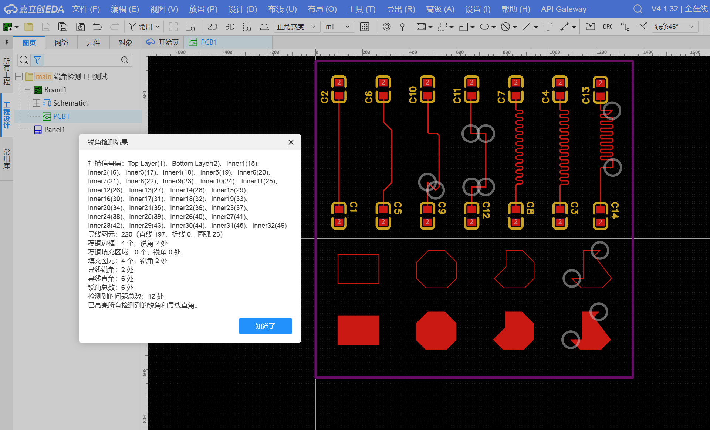

# 锐角检测

嘉立创EDA专业版扩展，用于检查 PCB 信号层上的导线锐角/直角，以及覆铜和填充区域的锐角。

作者：鸢枭

## 功能

- 从当前 PCB 的图层配置中自动找出所有 `SIGNAL` 信号层（包括顶层、底层和信号型内层）。
- 扫描直线、折线和圆弧导线，并检查导线连接点与折线顶点。
- 扫描覆铜边框、覆铜重建后的填充区域，以及填充图元的多边形边界。
- 导线检测小于 90° 的锐角和约 90° 的直角（直角容差 ±1°）。
- 覆铜边框、覆铜填充区域和填充图元只检测小于 90° 的锐角，不检测直角。
- 检测完成后分别报告导线锐角、导线直角及各类覆铜/填充锐角数量，并在当前 PCB 画布上用红色圆形标记高亮。

## 效果展示

点击“开始检测”后，扩展会扫描 PCB 信号层，并用圆形标记高亮检测到的导线锐角、导线直角及覆铜/填充锐角位置。



## 构建

需要 Node.js 20.17 或更高版本：

```powershell
npm install
npm run lint
npm run build
```

构建产物位于 `build/dist/sharp-angle-detector_v1.0.3.eext`。在嘉立创EDA专业版中通过“高级 -> 扩展管理器 -> 导入”加载该文件（V2 客户端使用“设置 -> 扩展 -> 扩展管理器 -> 导入扩展”）。

## 使用

打开并激活 PCB 后，在顶部菜单“锐角检测 -> 开始检测”运行。再次运行会先清除上一次的标记；“清除高亮”只移除标记，不修改任何 PCB 数据。

扩展只读 PCB 几何，不会自动修改、删除或重布线。圆弧本身是连续曲线，不作为折点计数；圆弧与其它导线在端点形成小于 90° 的连接时会纳入导线锐角检测，形成约 90° 的连接时会纳入导线直角检测。
